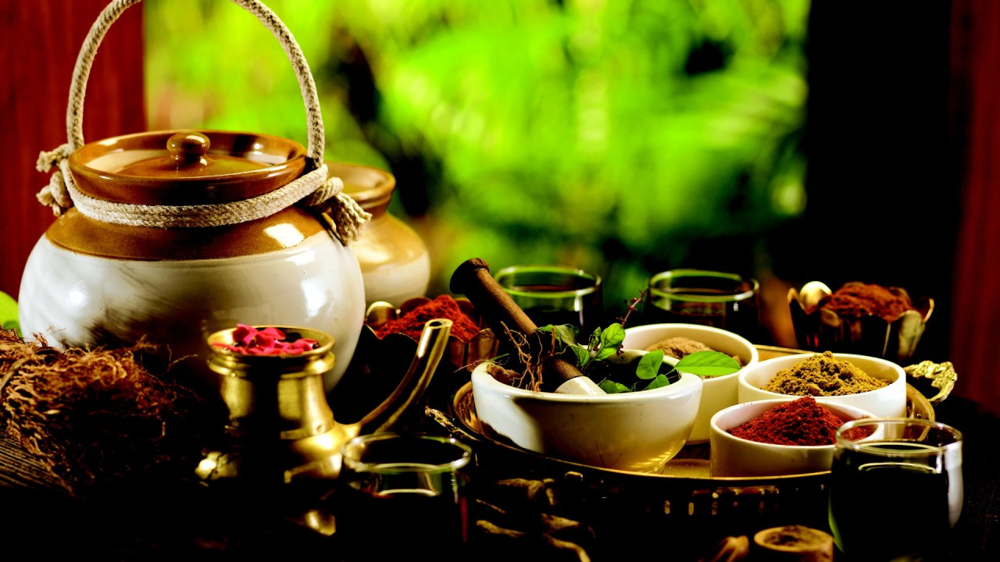

# AyurGenixAI 🌿 - An Ayurvedic Medication Advisor 💊



**Welcome to AyurGenixAI!**

AyurGenixAI is an innovative solution designed to bridge the gap between traditional Ayurvedic medicine and modern healthcare. Utilizing advanced AI technologies, including natural language processing (NLP) and machine learning (ML), AyurGenixAI provides personalized Ayurvedic medication recommendations based on classical texts and user inputs. This integration of ancient wisdom with contemporary medical practices aims to enhance holistic health and wellness.

## Problem Description

1. Finding reliable and personalized Ayurvedic medication advice is challenging in today's fast-paced world. 
2. Many people seek natural remedies but struggle to get accurate and tailored recommendations for their specific symptoms and conditions.

## Solution Provided

1. AyurGenixAI uses advanced NLP and ML technologies to provide personalized Ayurvedic medication recommendations. 
2. Users can input symptoms into a user-friendly interface to receive precise advice on Ayurvedic remedies, promoting overall health and wellness.
3. The recommendation can include details such as herbs, dietary changes, lifestyle modifications, and other home remedies.

## 🔬 Motivation
In the modern digital era, users often struggle to access personalized and trustworthy Ayurvedic healthcare. AyurGenixAI addresses these challenges by delivering accurate, evidence-based, and individualized recommendations, digitizing Ayurveda using intelligent systems.

## Features
- **User Input Analysis:** Captures and processes user symptoms and conditions.
- **Generative AI-Based Recommendations (LLaMA 3.1):** Suggests Ayurvedic medications tailored to individual needs.
- **Extensive Database:** Utilizes a comprehensive database of Ayurvedic treatments and their uses.
- **Interactive Interface:** Easy-to-use interface for a seamless user experience.
- **Human-in-the-Loop (HITL) Validation Workflow** – Expert practitioners validate AI-generated recommendations, ensuring clinical reliability, accuracy, and adherence to Ayurvedic principles.
- **Secure and Confidential:** Ensures user data privacy and security.


## 📊 Dataset Information

**Title**: AyurGenixAI: Ayurvedic Dataset  
**Source**: [Kaggle Dataset – DOI](https://doi.org/10.34740/KAGGLE/DS/7148374)  
**Entries**: 15,160  
**Diseases Covered**: 447  
**Attributes**: 35 holistic parameters  
**Derived From**: Ancient Ayurvedic scriptures, clinical sources, and validated inputs

> This structured dataset powers the AI models by providing rich, diverse, and meaningful health insights.

## ⚙️ System Architecture

| Component     | Description                                                                 |
|--------------|-----------------------------------------------------------------------------|
| **Frontend** | Django templates (HTML/CSS), responsive UI                                 |
| **Backend**  | Django REST Framework, PostgreSQL for user and medical data                |
| **AI Engine**| NLP pipeline + LLaMA 3.1 (Generative AI) for context-aware recommendations |
| **Database** | PostgreSQL                                                                  |
| **Chatbot**  | LLaMA-based multilingual, dynamic chatbot                                   |
| **Deployment**| Render                                                                     |
| **Backend Framework**       | FastAPI                                                      |

## 🛠️ Technology Stack

| Category         | Tools & Frameworks                                                                 |
|------------------|-------------------------------------------------------------------------------------|
| **Programming**  | Python                                                                             |
| **Frameworks**   | Django, Django REST Framework                                                      |
| **AI/ML**        | Scikit-learn, Hugging Face Transformers, PyTorch, Ollama (LLaMA 3.1)               |
| **NLP**          | NLTK, LLaMA                                                                        |
| **Database**     | PostgreSQL                                                                         |
| **Frontend**     | HTML, CSS                                                                          |
| **Deployment**   | Render                                                                             |
| **Backend Framework**       | FastAPI                                                                 |

## Components
- **Data Processing:** Scripts for preprocessing data and preparing it for model training.
- **Model Training:** Scripts for training NLP and ML models to analyze symptoms and recommend medications.
- **Recommendation Engine:** Core logic for generating personalized Ayurvedic medication recommendations.

## Setup and Installation

### Prerequisites
- Anaconda/Miniconda
- Python 3.x

### Installation
1. **Clone the repository**
   ```sh
   git clone https://github.com/kittu-122/AyurGenixAI.git
   cd AyurGenixAI
   ```

2. **Create a new conda environment and install dependencies**
   ```sh
   conda env create -f environment.yml
   conda activate ayurveda_env
   ```

3. **Install NLTK data**
   ```python
   import nltk
   nltk.download('punkt')
   nltk.download('averaged_perceptron_tagger')
   ```

## Usage

### Step 1: Preprocess Text Data
Run the `text_processing.py` script to preprocess the Ayurvedic text files.

```sh
python preprocessing/text_processing.py
```

### Step 2: Analyze Text Data
Run the `nlp_analysis.py` script to perform NLP analysis and extract relevant information from the preprocessed text.

```sh
python preprocessing/nlp_analysis.py
```

### Step 3: Generate Recommendations
Run the `formulation_engine.py` script to generate Ayurvedic drug and formulation recommendations based on input symptoms or pharmacological properties.

```sh
python recommendation/formulation_engine.py
```

## 🔍 Key Attributes and Features in Dataset

### 1. Patient-Specific Information
- Age Group, Gender, Occupation and Lifestyle, Cultural Preferences, Family History

### 2. Symptoms and Diagnosis
- Disease (English, Hindi, Marathi), Hindi Name, Marathi Name, Symptoms, Diagnosis & Tests, Symptom Severity, Duration of Treatment

### 3. Medical and Environmental Factors
- Medical History, Current Medications, Risk Factors, Environmental Factors, Sleep Patterns, Stress Levels, Physical Activity Levels

### 4. Ayurvedic Insights
- Doshas, Constitution/Prakriti, Seasonal Variation, Dietary Habits, Herbal Formulations, Herbal/Alternative Remedies

### 5. Treatment Approaches
- Diet and Lifestyle Recommendations, Yoga & Physical Therapy, Medical Intervention, Prevention, Prognosis, Complications, Patient Recommendations

### 6. Additional Parameters
- Allergies (Food/Environmental), Cultural Preferences, Formulation


## 🧪 Performance Highlights

| Model           | Accuracy |
|----------------|----------|
| Random Forest  | 55%      |
| XGBoost        | 85%      |
| **LLaMA 3.1**  | **90%**  |

- **System Usability**: High SUS scores in end-user testing  
- **Clinical Accuracy**: Validated by Ayurvedic experts  
- **Human-in-the-Loop Assurance**: Ayurvedic practitioners review and refine AI-generated outputs, ensuring reliability, clinical relevance, and alignment with traditional healing principles.

## 📚 Documentation Links

### 1. NLP Model 
- [Hugging Face Transformers – BERT Fine-Tuning](https://huggingface.co/transformers/training.html)  
  **Use**: Best practices for fine-tuning BERT on custom Ayurvedic symptom datasets.

### 2. Generative AI – Ollama + LLaMA
- [Ollama Documentation](https://ollama.com)  
  **Use**: Run and deploy LLaMA 3.1 models efficiently for healthcare NLP applications.

- [LLaMA Model by Meta](https://ai.meta.com/llama/)  
  **Use**: Official resources for LLaMA pre-trained models and their customization.

### 3. Backend Development
- [Django Documentation](https://docs.djangoproject.com/en/stable/)  
  **Use**: Build robust, secure, and scalable web apps with REST APIs.

- [Django REST Framework](https://www.django-rest-framework.org/)  
  **Use**: Essential for backend API development and database integration.

### 4. Database
- [PostgreSQL Docs](https://www.postgresql.org/docs/)  
  **Use**: Reliable, SQL-based storage for structured Ayurvedic data.

### 5. Model Training Frameworks
- [PyTorch](https://pytorch.org/docs/stable/index.html)  
  **Use**: Ideal for custom NLP model experimentation and LLaMA fine-tuning.

- [Hugging Face Model Hub](https://huggingface.co/models)  
  **Use**: Access to pre-trained healthcare NLP models and finetuning utilities.

### 6. Deployment Platforms  
- [Render](https://render.com/docs)  
  **Use**: Full-stack deployment platform supporting web services, static sites, background workers, and APIs. Automatically deploys from Git repositories.

### 7. Backend Framework  
- [FastAPI](https://fastapi.tiangolo.com/)  
  **Use**: Modern, high-performance Python framework for building APIs. Offers asynchronous support, automatic docs (Swagger & ReDoc), and is ideal for scalable applications.


## 📜 Citation

If you use the dataset or AyurGenixAI in your work, please cite:

```plaintext
Kirti Rane, Yadnesh Bhanushali, and Nikita Yadav. (2025). AyurGenixAI: Ayurvedic Dataset [Data set]. Kaggle. https://doi.org/10.34740/KAGGLE/DS/7148374
```

## Accessing the Website  
You can access the deployed AyurGenixAI service using the following link:  
👉 [AyurGenixAI Web App](https://ayurgenix-service-en5p.onrender.com/)

## Contributing
Contributions to the project are welcome! Feel free to submit pull requests, report issues, or suggest enhancements to improve AyurGenixAI.

**Thank you for choosing this project. Hoping that this project proves useful and delivers a seamless experience for your needs!**


